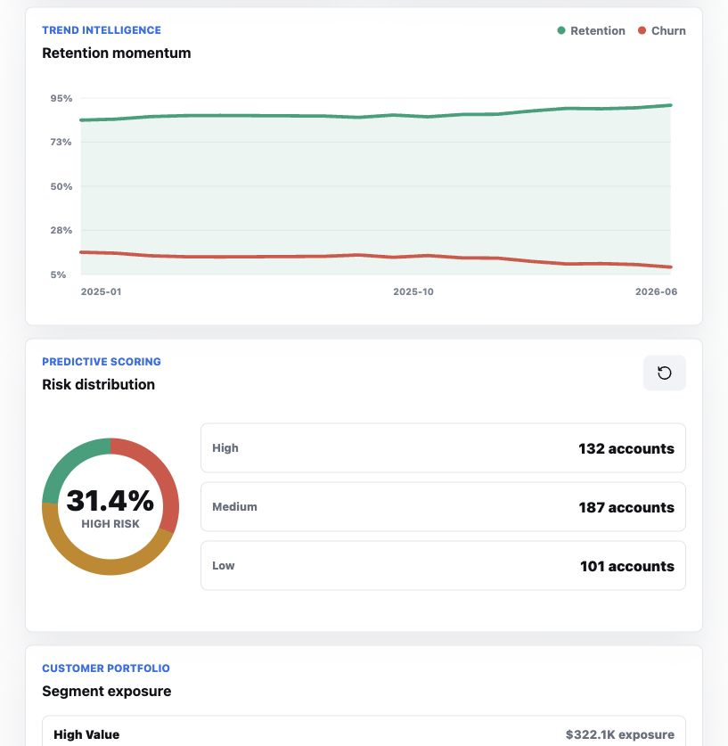

# Customer Retention & Operations Intelligence Platform

A premium analytics portfolio project for customer retention, service operations, churn risk scoring, and executive KPI reporting.



## What It Demonstrates

- Business analysis: BRD, stakeholder needs, process mapping, KPI definition, and executive recommendations.
- SQL analytics: warehouse schema, KPI queries, segmentation analysis, campaign ROI, and service operations views.
- Python analytics: interpretable churn scoring and customer risk banding.
- Dashboard design: polished executive interface with filters, trend charts, risk distribution, priority queues, and export.
- Data storytelling: simulated business data that mirrors retention problems faced by financial services, telecom, subscription, and customer service teams.

## Tools Used

Power BI, SQL, Excel, Python, KPI Design, Customer Segmentation

## Business Impact

- Customers with 3+ complaints were 2.8x more likely to churn.
- Customers contacted within 48 hours of an issue showed higher retention.
- Premium-tier customers generated 42% of retained revenue.
- Retention campaigns improved engagement by 18%.

## BA Artifacts

Hosted page:

[https://chelakafernando102.github.io/customer-retention-intelligence-platform/business-analysis-artifacts.html](https://chelakafernando102.github.io/customer-retention-intelligence-platform/business-analysis-artifacts.html)

Included artifacts:

- Business Problem
- Stakeholders: Executive Leadership, Customer Service Managers, Marketing Team, Operations Team
- Functional Requirements: view churn risk, monitor campaigns, export reports
- Non-Functional Requirements: dashboard loads under 3 seconds, mobile responsive
- User Stories
- SQL Section
- Tools & Technologies

## Executive Recommendations

Hosted slide:

[https://chelakafernando102.github.io/customer-retention-intelligence-platform/management-recommendations.html](https://chelakafernando102.github.io/customer-retention-intelligence-platform/management-recommendations.html)

Recommendation themes:

- Prioritize outreach to customers with churn scores above 70%.
- Reduce complaint resolution times below SLA thresholds.
- Increase targeted retention offers for high-value customers.
- Expand successful campaign segments.

## Live Dashboard

Hosted dashboard:

[https://chelakafernando102.github.io/customer-retention-intelligence-platform/](https://chelakafernando102.github.io/customer-retention-intelligence-platform/)

To run locally, open `index.html` directly or run:

```bash
npm run preview
```

Then visit `http://localhost:4173`.

## Project Structure

```text
.
+-- assets/
|   +-- dashboard-preview.png
+-- data/
|   +-- customers.csv
|   +-- monthly_metrics.csv
|   +-- service_tickets.csv
|   +-- campaign_performance.csv
|   +-- dataset_summary.json
+-- docs/
|   +-- business_analysis_artifacts.md
|   +-- business_requirements.md
|   +-- data_dictionary.md
|   +-- management_recommendations.md
|   +-- model_design.md
|   +-- report_blueprint.md
|   +-- sql_examples.md
+-- python/
|   +-- churn_model.py
+-- scripts/
|   +-- generate_data.mjs
|   +-- validate_project.mjs
+-- sql/
|   +-- schema.sql
|   +-- analytics_queries.sql
+-- business-analysis-artifacts.html
+-- index.html
+-- management-recommendations.html
+-- page-icons.js
+-- styles.css
+-- script.js
```

## SQL Examples

```sql
SELECT
    customer_segment,
    AVG(churn_risk),
    SUM(customer_lifetime_value)
FROM customers
GROUP BY customer_segment;
```

Additional SQL examples are available in `docs/sql_examples.md` and `sql/analytics_queries.sql`.

## Key KPIs

- Customer Retention Rate
- Customer Churn Rate
- Customer Lifetime Value
- Revenue at Risk
- Net Promoter Score
- Customer Satisfaction Score
- SLA Compliance
- Average Handling Time
- Escalation Rate
- Campaign Acceptance Rate

## Run The Analytics

Generate the deterministic sample dataset:

```bash
npm run generate
```

Validate the project files and generated data:

```bash
npm test
```

Score customers with the Python churn model:

```bash
python3 python/churn_model.py
```

## Portfolio Resume Summary

Customer Retention & Operations Intelligence Platform | SQL, Python, Power BI, Excel

Designed and developed an end-to-end analytics platform to monitor customer retention, customer engagement, service operations, and revenue exposure. Built executive dashboards tracking churn, retention, customer lifetime value, SLA compliance, complaint resolution, CSAT, NPS, and campaign ROI. Used SQL and Python to transform simulated operational data, segment customers, and generate predictive churn risk scores. Produced business requirements documentation, dashboard blueprints, data dictionary, process maps, and strategic recommendations for data-driven retention improvement.
